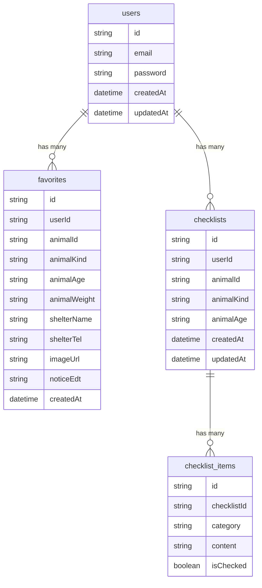

# ERD (Entity Relationship Document) — matchpaw

**문서 버전**: v0.1
**작성자**: 개인 프로젝트
**최초 작성일**: 2026-06-11
**최종 수정일**: 2026-06-11
**참조 TDD**: v0.2
**상태**: [x] 초안 / [ ] 진행 중 / [ ] 완료

---

## 0. 문서 목적

이 문서는 **matchpaw** 의 데이터베이스 설계를 정의한다.

각 테이블의 역할, 컬럼 명세, 테이블 간 관계, 그리고 주요 설계 결정의 근거를 기록한다.

유기동물 원본 데이터(공공 API 실시간 조회)는 DB에 저장하지 않는다. 찜 저장 시점의 핵심 정보만 `favorites` 테이블에 스냅샷 형태로 저장한다.

---

## 1. 다이어그램

---

## 2. 테이블 명세

### 2-1. users

> 서비스에 가입한 회원 정보를 저장한다.

| 컬럼명 | 타입 | NULL | 기본값 | 키 | 설명 |
|---|---|---|---|---|---|
| `id` | `STRING` | NOT NULL | `cuid()` | PK | CUID 기반 고유 식별자 |
| `email` | `STRING` | NOT NULL | — | UK | 로그인에 사용하는 이메일 주소 |
| `password` | `STRING` | NOT NULL | — | — | bcrypt 해시값 (평문 저장 금지) |
| `createdAt` | `DATETIME` | NOT NULL | `now()` | — | 레코드 생성 시각 |
| `updatedAt` | `DATETIME` | NOT NULL | — | — | 레코드 마지막 수정 시각 (자동 갱신) |

**제약 조건**

- `email`은 전체 테이블에서 유일해야 한다. 중복 가입 방지.

---

### 2-2. favorites

> 회원이 찜한 유기동물 정보를 스냅샷 형태로 저장한다. 공공 API 원본이 입양완료·사망으로 변경·삭제되어도 찜 목록에서 동물 정보를 유지할 수 있도록 저장 시점의 핵심 컬럼을 복사해 둔다.

| 컬럼명 | 타입 | NULL | 기본값 | 키 | 설명 |
|---|---|---|---|---|---|
| `id` | `STRING` | NOT NULL | `cuid()` | PK | CUID 기반 고유 식별자 |
| `userId` | `STRING` | NOT NULL | — | FK → `users.id` | 찜한 회원 ID |
| `animalId` | `STRING` | NOT NULL | — | IDX | 공공 API의 desertionNo (원본 동물 고유 번호) |
| `animalKind` | `STRING` | NOT NULL | — | — | 동물 종류 (예: 개, 고양이, 기타축종) |
| `animalAge` | `STRING` | NOT NULL | — | — | 동물 나이 (예: 2023(년생)) |
| `animalWeight` | `STRING` | NULL | — | — | 동물 체중 (예: 5.0 (kg)) |
| `shelterName` | `STRING` | NOT NULL | — | — | 보호소 이름 |
| `shelterTel` | `STRING` | NULL | — | — | 보호소 연락처 |
| `imageUrl` | `STRING` | NULL | — | — | 동물 사진 URL (공공 API popfile) |
| `noticeEdt` | `STRING` | NOT NULL | — | — | 공고 종료일 (YYYYMMDD 형식, D-day 계산용) |
| `createdAt` | `DATETIME` | NOT NULL | `now()` | — | 찜 저장 시각 |

**제약 조건**

- `(userId, animalId)` 조합은 유일해야 한다. 동일 동물 중복 찜 방지.

---

### 2-3. checklists

> AI가 생성한 입양 체크리스트를 회원별로 저장한다. 비회원은 이 테이블에 저장하지 않는다.

| 컬럼명 | 타입 | NULL | 기본값 | 키 | 설명 |
|---|---|---|---|---|---|
| `id` | `STRING` | NOT NULL | `cuid()` | PK | CUID 기반 고유 식별자 |
| `userId` | `STRING` | NOT NULL | — | FK → `users.id` | 체크리스트를 저장한 회원 ID |
| `animalId` | `STRING` | NOT NULL | — | — | 대상 동물 ID (공공 API desertionNo) |
| `animalKind` | `STRING` | NOT NULL | — | — | 동물 종류 (체크리스트 생성 입력값) |
| `animalAge` | `STRING` | NOT NULL | — | — | 동물 나이 (체크리스트 생성 입력값) |
| `createdAt` | `DATETIME` | NOT NULL | `now()` | — | 레코드 생성 시각 |
| `updatedAt` | `DATETIME` | NOT NULL | — | — | 레코드 마지막 수정 시각 (자동 갱신) |

**제약 조건**

- `(userId, animalId)` 조합은 유일해야 한다. 같은 동물에 대해 중복 체크리스트 생성 방지.

---

### 2-4. checklist_items

> 체크리스트의 개별 항목과 회원의 완료 체크 여부를 저장한다.

| 컬럼명 | 타입 | NULL | 기본값 | 키 | 설명 |
|---|---|---|---|---|---|
| `id` | `STRING` | NOT NULL | `cuid()` | PK | CUID 기반 고유 식별자 |
| `checklistId` | `STRING` | NOT NULL | — | FK → `checklists.id` | 속한 체크리스트 ID |
| `category` | `STRING` | NOT NULL | — | IDX | 항목 분류 (준비물 / 예방접종 / 환경 준비) |
| `content` | `STRING` | NOT NULL | — | — | AI가 생성한 항목 내용 |
| `isChecked` | `BOOLEAN` | NOT NULL | `false` | — | 회원의 완료 체크 여부 |

**제약 조건**

- 해당 없음

---

## 3. 관계 정의

| 관계 | 종류 | onDelete | 설명 |
|---|---|---|---|
| `users` → `favorites` | 1 : N | `CASCADE` | 회원이 탈퇴하면 찜 목록도 함께 삭제된다 |
| `users` → `checklists` | 1 : N | `CASCADE` | 회원이 탈퇴하면 저장된 체크리스트도 함께 삭제된다 |
| `checklists` → `checklist_items` | 1 : N | `CASCADE` | 체크리스트가 삭제되면 항목도 함께 삭제된다 |

---

## 4. 인덱스 전략

| 테이블 | 인덱스 컬럼 | 종류 | 이유 |
|---|---|---|---|
| `users` | `email` | 단일 (UK) | 로그인 시 이메일로 사용자 조회. 전체 테이블 스캔 방지 |
| `favorites` | `(userId, animalId)` | 복합 (UK) | 찜 중복 체크 쿼리(`WHERE userId AND animalId`)에 사용. 유니크 제약도 겸함 |
| `favorites` | `userId` | 단일 | 회원별 찜 목록 조회(`WHERE userId`) 성능 개선 |
| `checklist_items` | `checklistId` | 단일 | 체크리스트별 항목 조회(`WHERE checklistId`) 성능 개선 |
| `checklist_items` | `category` | 단일 | 카테고리별 항목 필터링 쿼리(`WHERE category`)에 사용 |
| `checklists` | `(userId, animalId)` | 복합 (UK) | 동일 동물 중복 체크리스트 방지. 유니크 제약도 겸함 |

---

## 5. 설계 결정 사항

| 결정 | 선택 | 대안 | 이유 |
|---|---|---|---|
| 유기동물 데이터 저장 여부 | DB 미저장, 실시간 API 조회 | DB 주기적 동기화 | 공공 API가 자동승인 실시간 제공이므로 DB 동기화 복잡도 제거. 보호 상태 실시간 반영도 자연스럽게 해결 |
| 찜 목록 데이터 | 스냅샷 저장 (핵심 컬럼 복사) | 원본 API desertionNo만 FK로 저장 | 공공 API 원본이 입양완료·사망으로 삭제되어도 찜 목록에서 동물 정보를 유지하기 위해 |
| PK 타입 | CUID (문자열) | Auto Increment (정수) | URL 노출 시 순차 ID보다 보안상 유리. Prisma 기본 권장 방식 |
| 비회원 체크리스트 | DB 미저장 | 비회원 임시 세션 저장 | 비회원에게 DB row를 생성하지 않아 서버 부하 최소화. 비회원 체크는 세션 내 임시 사용 허용 |

---

## 6. DB 저장 범위 정의

| 데이터 | 저장 위치 | 이유 |
|---|---|---|
| 유기동물 원본 목록 | 외부 공공 API 실시간 조회 (DB 미저장) | 공공 API가 실시간 보호 상태를 제공하므로 DB 동기화 복잡도 없이 처리 |
| 찜 동물 정보 | DB (`favorites` 테이블 스냅샷) | 원본 API 데이터가 삭제되어도 찜 목록 데이터를 보존하기 위해 |
| AI 체크리스트 | DB (`checklists`, `checklist_items` 테이블) — 회원 전용 | 회원이 체크 진행 상황을 저장하고 언제든 재조회할 수 있어야 하므로 |
| 비회원 매칭 횟수 | 쿠키 (DB 미저장) | 비회원에게 DB row를 생성하지 않고 서버 부하를 최소화하기 위해 |
| JWT | httpOnly 쿠키 (DB 미저장) | Stateless 인증. XSS 방지를 위해 httpOnly 쿠키로 저장 |

---

## 부록

### 버전 히스토리

| 버전 | 날짜 | 변경 내용 |
|---|---|---|
| v0.1 | 2026-06-11 | 최초 작성 |

### 용어 정의

| 용어 | 정의 |
|---|---|
| 스냅샷 | 외부 API 원본이 변경·삭제되어도 데이터를 보존하기 위해 저장 시점의 동물 정보를 복사해 둔 레코드 |
| desertionNo | 국가동물보호정보시스템 공공 API가 제공하는 유기동물 고유 번호. `favorites.animalId`로 사용한다 |
| 보호중 | 공공 API `processState` 값 중 입양이 가능한 상태. "입양완료", "방사", "사망" 상태의 동물은 서버 측 필터에서 제외된다 |
